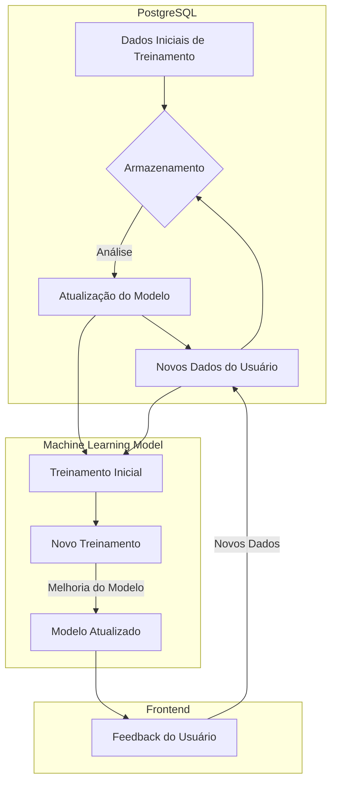

# API de Classificação de Características de Sêmen de Touros

Este repositório contém uma aplicação em Kotlin com Spring Boot que fornece uma API para conexão com o frontend desenvolvido em React. A principal funcionalidade da API é a classificação da reprodutividade de touros com base nas características do sêmen dos animais. O backend utiliza algoritmos de machine learning escritos em Python para realizar essa classificação.


## Características de Entrada

As características do sêmen dos touros são representadas pela seguinte classe Kotlin:

```kotlin
data class Data(
    val idade: Float,
    val peso: Float,
    val ec: Float,
    val ce: Float,
    val temp_retal: Float,
    val temp_amb: Float,
    val umidade: Float,
    val mov_flanco: Float,
    val hora: String,
    val turbilhao: Float,
    val mot_moveis: Float,
    val vigor: Float,
    val volume: Float,
    val zptz_106: Float,
    val zptz_totais: Float,
    val def_mai: Float,
    val def_mai_percent: Float,
    val def_men: Float,
    val def_men_percent: Float,
    val normais: Float,
    val normais_percent: Float
)
```

## Funcionalidades da API

A API oferece um endpoint para enviar as informações das características do sêmen através de uma requisição POST. Em resposta, retorna se o animal está apto para reprodução, está apto com restrições ou não está apto, juntamente com a precisão da previsão.


## Implantação e Acesso

- **Backend:** [Google Cloud](https://app-cz7upoyahq-uc.a.run.app)
- **Frontend:** [Vercel](https://sperm-traits-classify-ml-front.vercel.app)


## Machine Learning com Python e Random Forest

O coração da inteligência por trás desta aplicação reside no ambiente Python. É aqui que ocorre o processamento de dados e a entrega das previsões dos resultados. Utilizamos o poderoso algoritmo Random Forest, uma técnica de aprendizado supervisionado amplamente reconhecida por sua eficácia em lidar com conjuntos de dados complexos e variáveis independentes.


O modelo é treinado com os dados coletados e armazenados no PostgreSQL, onde o Python entra em ação para realizar o treinamento inicial e subsequentes atualizações do modelo. Uma vez treinado, o modelo é capaz de fazer previsões precisas com base nas características do sêmen dos touros fornecidas pelo usuário. Esse ciclo contínuo de treinamento e previsão é fundamental para garantir que o modelo se adapte dinamicamente aos novos dados, mantendo-se atualizado e confiável.



## Conclusão

A API de Classificação de Características de Sêmen de Touros representa uma integração poderosa entre a tecnologia de backend e o processamento de machine learning. Ao combinar o poder do Kotlin com o Spring Boot para o backend e o Python com o algoritmo Random Forest para o machine learning, somos capazes de oferecer uma solução robusta e precisa para classificar a reprodutividade de touros com base em características do sêmen.

Com o acesso fácil à API através do frontend hospedado na Vercel, os usuários podem facilmente enviar as informações necessárias e receber previsões rápidas e precisas sobre a aptidão para reprodução dos animais. Além disso, o ciclo contínuo de treinamento e atualização do modelo garante que o sistema permaneça adaptável e eficaz ao longo do tempo, à medida que novos dados são recebidos e analisados.

Este projeto é um exemplo emocionante de como a tecnologia pode ser aplicada para melhorar processos em áreas tão diversas quanto a agricultura e a reprodução animal, demonstrando o potencial da inovação tecnológica para resolver desafios do mundo real.

